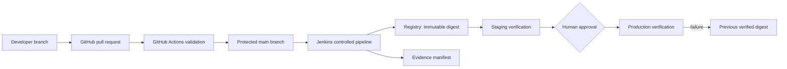

# Project C — Gstack-Governed CI/CD Delivery Platform

## Objective

Demonstrate controlled software delivery through GitHub PR validation and Jenkins promotion of one immutable container image from build through staging, production verification, and rollback.

## Users and outcomes

- Developers receive fast, credential-free PR feedback.
- Release operators receive a controlled, auditable promotion path.
- Reviewers can trace a commit to an image digest, checks, approval, deployed state, and rollback target.

## Architecture

GitHub Actions answers whether a change is safe to merge. Jenkins independently answers whether the approved commit can be built, promoted, deployed, verified, and recovered.

## Definition of done

- Required GitHub validation checks pass and a blocked-change example is recorded.
- Jenkins builds once, publishes an immutable digest, verifies staging, requires production approval, and verifies production.
- A failed verification restores the previous recorded image.
- Credentials remain scoped and absent from source, logs, images, and evidence.
- Release evidence and a change record connect the commit, digest, checks, approval, deployment, and rollback target.

## Claim boundaries

This repository proves a production-like local delivery workflow and CI/CD engineering judgment. It does not prove sustained production use, organizational-scale Jenkins administration, live AWS operation, or zero-risk security. AWS claims require completion of the separately marked optional validation phase.

