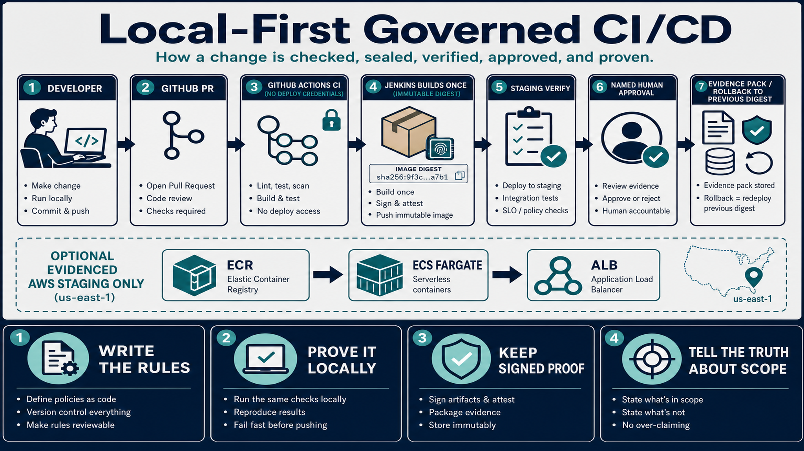
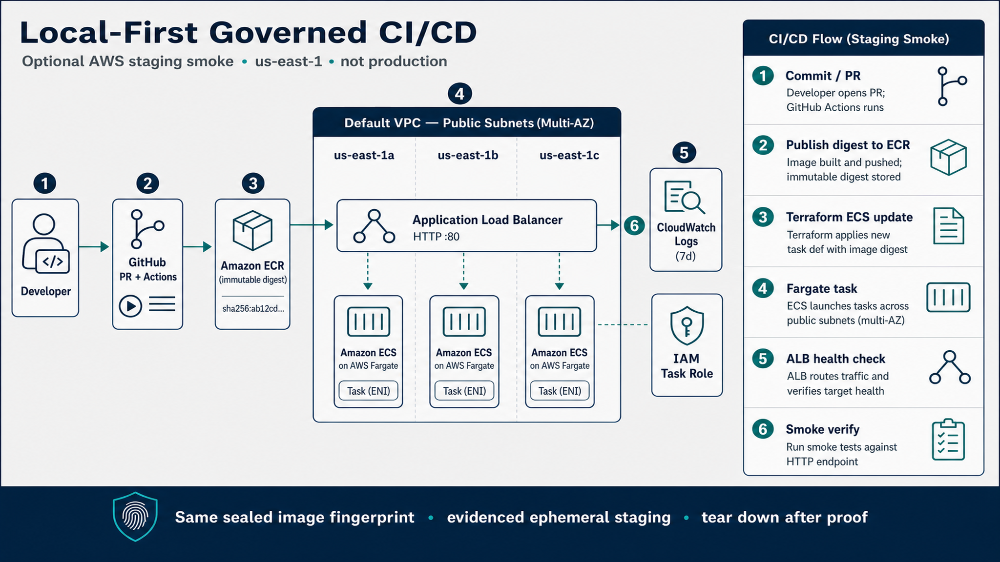

# Local-First Governed CI/CD

Credential-free PR checks, one sealed image digest, staging verify, named human approval, evidence packs, and rollback when verify fails. Primary proof is local / production-like delivery. AWS staging in `us-east-1` is staging-validated with retained evidence — not sustained production ops.



<p align="center"><em>Primary diagram: end-to-end production-like delivery path. Read left to right.</em></p>

<p align="center"><sub>
Diagrams use generic icons and plain product-name text only (no third-party logo artwork).
Jenkins® is a registered trademark of LF Charities Inc.
GitHub® and the Invertocat logo are trademarks of GitHub, Inc.
Terraform and the Terraform logo are trademarks of HashiCorp.
AWS and AWS service names are trademarks of Amazon.com, Inc. or its affiliates.
Names identify tools used in this project and do not imply affiliation or endorsement.
Reference mark files (not used in these figures): <a href="docs/brand/">docs/brand/</a>.
</sub></p>

## What this project is

A delivery control plane for a small API: GitHub validates the change without deploy keys, Jenkins® builds **one** immutable image fingerprint, staging must pass, a **named person** approves promotion, evidence is kept, and a bad verify rolls back to the last good digest.

Repo: `nathanielecon/local-first-governed-cicd` (older citations may still say `project-c-cloud`).

## What the delivery diagram means

1. **Developer / PR** — Change lands for review.
2. **GitHub Actions CI** — Lint, tests, scans. No registry or deploy credentials on the PR job.
3. **Jenkins® builds once** — One sealed image digest. Same fingerprint promoted; no rebuild between environments.
4. **Staging verify** — Prove it works before promotion is even available.
5. **Named human approval** — A person says yes. Not a silent auto-promote.
6. **Evidence / rollback** — Keep receipts. If verify fails, restore the previous verified digest.

## AWS staging architecture (staging-validated)

Canonical draw.io source: [`docs/project-c-phase9-staging-architecture.drawio`](docs/project-c-phase9-staging-architecture.drawio). Polished Image2 view:



<p align="center"><em>Staging-validated AWS path: immutable ECR digest on ECS/Fargate behind ALB in us-east-1. Evidenced smoke with retained receipts — not sustained production.</em></p>

Plain-language map of that picture:

1. Commit / PR — GitHub Actions checks merge safety.
2. Publish immutable image — build and push digest to Amazon ECR.
3. ECS service update — Terraform points the task at that digest.
4. Fargate task — run the API (staging size).
5. ALB health — load balancer checks `/health/ready`.
6. Smoke verify — hit live/ready/version through the ALB; keep the evidence.

Facts and leftovers: [`docs/aws-validation.md`](docs/aws-validation.md), [`evidence/phase-9/governing-manifest.json`](evidence/phase-9/governing-manifest.json).

## Quick start

Needs Docker Desktop (Linux containers), PowerShell 7 on Windows, Git, and Python 3.12+.

```powershell
./scripts/project.ps1 bootstrap --skip-docker
./scripts/project.ps1 status
./scripts/project.ps1 issues
./scripts/project.ps1 validate phase-1
```

On Linux/WSL use `./project` with the same subcommands. After bootstrap: app `http://localhost:8081`, production-like lane `http://localhost:8082`, Jenkins `http://localhost:8080`.

Set local-only Jenkins placeholder identities before starting Jenkins (`JENKINS_LOCAL_ADMIN_ID`, `JENKINS_LOCAL_ADMIN_PASSWORD`, `JENKINS_LOCAL_APPROVER_ID`, `JENKINS_LOCAL_APPROVER_PASSWORD`, `JENKINS_LOCAL_VIEWER_ID`, `JENKINS_LOCAL_VIEWER_PASSWORD`) from your shell or an untracked env file. This repo does not ship shared default Jenkins passwords.

```text
project bootstrap [--skip-docker]
project status [--phase N] [--task ID]
project issues [--status STATE] [--severity LEVEL]
project phase N [--task ID] [--dry-run]
project validate <scope>
project resume <task-id>
project evidence <release-id>
```

## Delivery contract

- PR workflows get no registry or deployment credentials.
- Build once; promote by immutable digest. Do not rebuild between environments.
- Staging must pass before production approval is available.
- Production promotion needs a human decision.
- Failed verify restores the previous recorded image.
- Local / production-like proof is not the same as sustained cloud production ops.

## Read next

| Path | Why |
| --- | --- |
| [Portfolio walkthrough](docs/portfolio-walkthrough.md) | Recruiter story with evidence-bound claims |
| [Runbook](docs/runbook.md) | Operate and recover locally |
| [Evidence index](evidence/README.md) | Where release evidence lives |
| [Phase 8 portfolio index](docs/change-records/phase-8-portfolio-index.md) | Portfolio trio and change-record map |
| [Phase 9 architecture note](docs/architecture/phase-9-aws.md) | Staging SRE / GitOps residuals |
| [Orchestration contract](docs/orchestration.md) | How gated work is authorized |
| [Public naming](docs/public-naming.md) | Display title vs repository slug |

## Honest scope

Primary proof is local / production-like delivery (phases 2–8) plus GitHub-hosted PR checks. AWS staging in `us-east-1` is **staging-validated** with retained evidence — not sustained production ops.

Still disclosed (not papered over): local Jenkins Docker-socket / root controller privilege; operator-attested rollback parameters; Phase 9 used a login session (not least-privilege OIDC); ALB was HTTP-only for that short proof. See the AWS note and phase security reviews.
