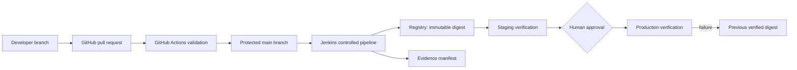

# Project C — Portfolio Walkthrough

**Claim boundary (headline):** local-only / production-like / non-AWS. This package demonstrates controlled delivery engineering with retained evidence. It does **not** claim live AWS, organizational production approval, sustained production traffic, or zero-risk security.

Authority for labels and inventory: `docs/portfolio-plan.md`. Every claim below uses the portfolio-plan claim taxonomy (`Implemented`, `Locally verified`, `GitHub-verified`, `Human-approved`, or `Deferred`).

---

## 1. Architecture and authorship

**Taxonomy:** Implemented (delivery path contracts) + Locally verified (phases 2–7 gates) + Deferred (live cloud).

Controlled delivery path (from `PROJECT.md`):

| Stage | Responsibility | Evidence / contract |
| --- | --- | --- |
| GitHub PR validation | Credential-free merge safety | `.github/workflows/pr-validation.yml`; hosted runs below |
| Immutable digest | Build once; promote by digest | Phase 3 image/Compose; Phase 6 digest-bound scripts |
| Staging verify | Smoke / negative gates | Phase 3 runtime; Phase 6 staging events |
| Human approval | Named approver, persisted | Phase 5 authz; Phase 6 `local-approver` fixture |
| Production verify | Same digest identity | Phase 6 events / manifest |
| Rollback target | Prior verified digest or first-release decision | Phase 6 recovery contract |
| Evidence | Append-only events + derived summary | `scripts/evidence.py`; `evidence/phase-6/` |

GitHub Actions answers whether a change is safe to merge. Jenkins independently answers whether an approved commit can be built, promoted, verified, and recovered — under the **local-only / non-AWS** boundary for this package.

---

## 2. Claim table (taxonomy)

| Claim | Label | Governing pointer |
| --- | --- | --- |
| Delivery API + CLI harness | Implemented / Locally verified | `evidence/phase-2/integrated-gate.txt`; `docs/change-records/phase-2-local.md` |
| Multi-stage image, Compose, smoke | Implemented / Locally verified | `evidence/phase-3/integrated-gate.txt`; `docs/change-records/phase-3-local.md` |
| PR workflow + Jenkinsfile local contract | Implemented / Locally verified | `evidence/phase-4/integrated-gate.txt` |
| Hosted PR validation pass on `main` | GitHub-verified | Actions run `29166389732` @ `e82f4a2` |
| Safe blocked-change demo | GitHub-verified | Draft PR `#1`; run `29166442925` |
| Jenkins authz + unauthorized denial | Locally verified | `evidence/phase-5/integrated-gate.txt`; unauthorized proof |
| Append-only events + summary manifest | Locally verified | `evidence/phase-6/events.jsonl`; `manifest.json` |
| Named approval (`local-approver`) | Human-approved **local fixture** | `docs/change-records/phase-6-local.md`; event `p6-local-approval` |
| Rollback + `recovery_verified` | Locally verified (non-E2E) | Phase 6 recovery section; event `p6-local-recovery` |
| Failure-injection 12/12 lanes | Locally verified | `evidence/phase-7/integrated-gate.txt` |
| Live AWS / org production / live Jenkins E2E | Deferred | `docs/aws-validation.md`; `STATUS.md` unverified |

---

## 3. Mandatory trio

### 3.1 Blocked change (GitHub-verified)

**Required portfolio blocked change:** closed draft PR `#1` with intentional quality failure on hosted run `29166442925`.

| Field | Value |
| --- | --- |
| Repository | `nathanielecon/project-c-cloud` |
| PR | [#1](https://github.com/nathanielecon/project-c-cloud/pull/1) (draft, closed) |
| Failing run | [29166442925](https://github.com/nathanielecon/project-c-cloud/actions/runs/29166442925) |
| Failure class | Python quality only — intentional Ruff `F401` unused import in `tests/test_phase4_blocked_demo.py` |
| Non-claims | No deployment credentials, no Jenkins runtime promotion, no cloud activity |

**Contrast (same phase):** passing hosted run [29166389732](https://github.com/nathanielecon/project-c-cloud/actions/runs/29166389732) on `main` at commit `e82f4a2` (all four jobs green).

Pointers: `docs/change-records/phase-4-github-validation.md`; `evidence/phase-4/integrated-gate.txt`.

### 3.2 Named human approval event (Human-approved local fixture)

**Required portfolio approval event:** production-like approval by named fixture identity `local-approver` at `2026-07-13T17:15:00Z`.

| Field | Value |
| --- | --- |
| Approver identity | `local-approver` |
| Approved at (UTC) | `2026-07-13T17:15:00Z` |
| Event ID | `p6-local-approval` (`production_approval`) |
| Digest (candidate) | `sha256:bbbbbbbbbbbbbbbbbbbbbbbbbbbbbbbbbbbbbbbbbbbbbbbbbbbbbbbbbbbbbbbb` |
| Scope label | **Human-approved local fixture — not organizational production approval** |
| Pipeline note | `pipeline.run_id: manual` in derived manifest (synthetic fixture, not live E2E) |

Evidence agreement:

- `evidence/phase-6/events.jsonl` — `p6-local-approval`
- `evidence/phase-6/manifest.json` — `approvals[].approver_id=local-approver`
- `docs/change-records/phase-6-local.md` — Production approval section
- `evidence/phase-6/integrated-gate.txt`

**Related (not an approval):** Phase 5 unauthorized denial — `unauthorized_status=400`, header `X-Error=You need to be local-approver to submit this.`, final `ABORTED`, no production continuation (`evidence/phase-5/p5-t04-manual-verify2-unauthorized-proof.txt`). That proves named-approver enforcement; it is **not** the portfolio approval event.

### 3.3 Recovery (Locally verified, non-E2E)

**Required portfolio recovery:** Phase 6 rollback to prior verified digest with `recovery_verified` checks all pass.

| Field | Value |
| --- | --- |
| Prior verified digest | `sha256:aaaaaaaaaaaaaaaaaaaaaaaaaaaaaaaaaaaaaaaaaaaaaaaaaaaaaaaaaaaaaaaa` |
| Source release | `phase-6-prior-fixture` (verified `2026-07-12T18:00:00Z`) |
| Rollback executed | `2026-07-13T17:35:00Z` (change record); event `p6-local-rollback` |
| Recovery event | `p6-local-recovery` (`recovery_verified`) at `2026-07-13T17:40:00Z` |
| Checks | deployed_digest, health, version, business_behavior — all **pass** |
| Manifest status | `recovery_verified` |
| Non-claim | Not live Jenkins E2E; fixture path with `pipeline.run_id: manual` |

Pointers: `docs/change-records/phase-6-local.md` (Recovery section); `evidence/phase-6/events.jsonl`; `evidence/phase-6/manifest.json`; `evidence/phase-6/integrated-gate.txt`.

---

## 4. Authorization and unauthorized denial

**Taxonomy:** Locally verified (Phase 5 / `PC-001` local remediation).

Controls retained in evidence:

- External Compose credentials (no repo password fallback)
- Least-privilege JCasC roles (admin / approver / viewer)
- Named approvers via `PROJECT_C_ALLOWED_APPROVERS`
- Immutable trusted input `TRUSTED_GIT_SHA` (refs rejected; `PC-014` resolved)

Unauthorized path: local-viewer submit denied → `ABORTED` → no production continuation.

Pointers: `docs/change-records/phase-5-local.md`; `evidence/phase-5/integrated-gate.txt`; unauthorized proof file above; `docs/retrospectives/phase-5.md`.

---

## 5. Failure pressure (Phase 7)

**Taxonomy:** Locally verified; residual advisories retained, not cleared.

- Lane index: 12/12 scenarios `ok=True` (`evidence/phase-7/P7-T01-lane-index.txt`)
- Integrated agreement: `evidence/phase-7/integrated-gate.txt`
- Catalog: `docs/failure-injection.md`
- Index record: `docs/change-records/phase-7-local.md`

Residual advisories still disclosed (Docker socket/root; operator-attested rollback parameters; hardcoded verify maps). Phase 7 does not clear Phase 5/6 residuals.

---

## 6. Rejected alternatives and incident learning

| Learning | Outcome | Pointer |
| --- | --- | --- |
| Attempt-scoped fixture evidence (`PC-011`–`PC-013`) | Multi-attempt appended logs rejected as sole proof; bind image identity + runtime config | `docs/retrospectives/phase-5.md` |
| `TRUSTED_GIT_REF` rejected (`PC-014`) | Immutable 40-char `TRUSTED_GIT_SHA` required; refs/ rejected pre-fetch | Phase 5 change review + ISSUES |
| Shared design freeze for `PC-002`/`PC-003` | One SoT for events, digest identity, rollback readiness before implementation | `docs/retrospectives/phase-6.md`; `docs/phase-6-spec.md` |
| Staging-as-prior rejected | Staging identity is not an approved production rollback prior | Phase 6 eng-review; `p6-t03-promotion-gate-staging-rejected.txt` |

---

## 7. Phase evidence map

| Phase | Integrated gate / hosted | Change record |
| --- | --- | --- |
| 2 | `evidence/phase-2/integrated-gate.txt` | `docs/change-records/phase-2-local.md` |
| 3 | `evidence/phase-3/integrated-gate.txt` | `docs/change-records/phase-3-local.md` |
| 4 | `evidence/phase-4/integrated-gate.txt` + hosted runs | `docs/change-records/phase-4-github-validation.md` |
| 5 | `evidence/phase-5/integrated-gate.txt` | `docs/change-records/phase-5-local.md` |
| 6 | `evidence/phase-6/integrated-gate.txt` | `docs/change-records/phase-6-local.md` |
| 7 | `evidence/phase-7/integrated-gate.txt` | `docs/change-records/phase-7-local.md` |
| 8 (this package) | Assembly index only until `P8-T03` | `docs/change-records/phase-8-portfolio-index.md` |

Metrics extract: `docs/metrics.md`. Screenshot / evidence substitutes: `docs/screenshots/README.md`.

---

## 8. Deferred / out of scope

Explicitly **Deferred** (do not imply completion):

- Live AWS / Terraform / ECR / ECS / OIDC (`docs/aws-validation.md`; Phase 9)
- Digest promotion beyond local fixture evidence
- Production approval beyond the Phase 5/6 local fixture
- Live Jenkins E2E promotion and recovery
- Organizational-scale Jenkins administration
- Sustained production use / production traffic
- Clearance of residual security advisories
- Portfolio demo rehearsal (`P8-T02`) and Phase 8 integrated gate (`P8-T03`)

Root Codex / ChatGPT connector PNGs (`codex-landing.png`, `codex-cloud-current.png`, `github-connect.png`, `env-create-after-auth.png`), if shown, are **tooling-context only** — not GitHub Actions, Jenkins, recovery, or cloud proofs. See `docs/screenshots/README.md`.
